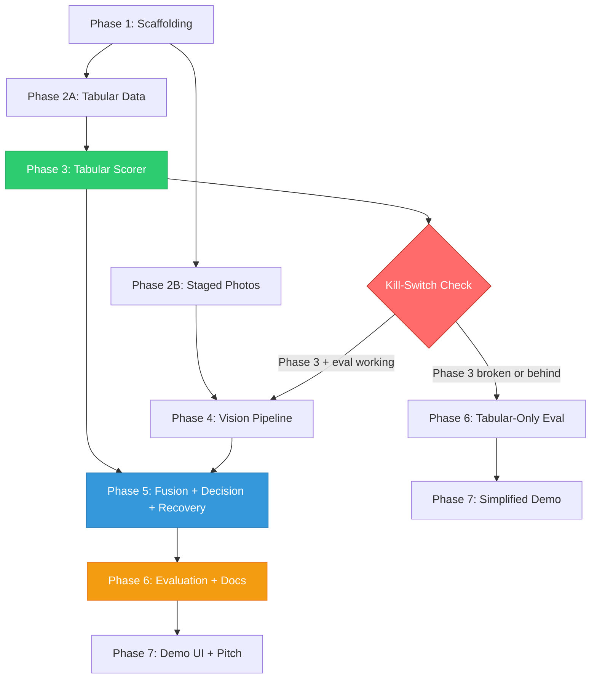

# Implementation Plan: Return-Risk Scorer with Visual Verification

## Goal

Build a **return-risk scorer** (primary system) with a **visual verification enhancement** (secondary signal) for the Razorpay AI Buildathon Track 02 ("AI Risk Manager"). The system detects empty-box and substituted-item return fraud using late fusion of tabular and vision signals, with three-way decision logic, a circuit breaker for graceful degradation, and honest evaluation on synthetic data with explicitly stated validity boundaries.

All 8 approved modifications from the critical evaluation are incorporated.

---

## Tech Stack Decisions

| Component | Choice | Rationale |
|-----------|--------|-----------|
| Language | Python 3.10+ | ML ecosystem, fast prototyping |
| Tabular model | LightGBM | Fast training, no GPU needed, interpretable feature importance |
| Vision — segmentation | SAM2 (segment-anything-2) | Empty-box detection via mask area |
| Vision — embeddings | DINOv2 (ViT-S/14 distilled) | Smallest variant; zero-shot semantic similarity; runs on CPU if needed |
| Meta-learner | Logistic regression (sklearn) | Interpretable, fast, appropriate for 4-5 input features |
| Evaluation | scikit-learn + matplotlib | PR curves, cost plots |
| Web framework | FastAPI | Lightweight, async, good for demo |
| Demo UI | Single-page HTML/CSS/JS (vanilla) | Zero dependencies, easy to demo |
| Audit storage | SQLite | Zero infrastructure, file-based, queryable |
| Repo | Public GitHub | Required by brief |

> [!IMPORTANT]
> **No GPU assumed.** All inference must work on CPU within ~10 seconds per request for demo purposes. SAM2 and DINOv2 outputs can be pre-computed for the demo dataset and cached, with live inference available for ad-hoc uploads.

---

## Phase 1: Scaffolding & Repo Structure

**Dependencies:** None — this is the starting point.

### What to build:

```
razorpay/
├── README.md                    # Project overview, architecture, limitations
├── LICENSE                      # MIT
├── requirements.txt             # Pinned dependencies
├── setup.py or pyproject.toml   # Package config
├── .gitignore
│
├── data/
│   ├── synthetic/               # Generated tabular data
│   │   ├── train.csv
│   │   ├── val.csv
│   │   └── test.csv             # Held-out, never touched during development
│   ├── images/                  # Staged product photos
│   │   ├── catalog/             # "Original" catalog images
│   │   └── returns/             # "Returned item" photos (legit + fraud)
│   └── generate_data.py         # Synthetic data generator script
│
├── src/
│   ├── __init__.py
│   ├── config.py                # All thresholds, costs, feature lists — single source of truth
│   ├── tabular/
│   │   ├── __init__.py
│   │   ├── features.py          # Feature engineering
│   │   ├── train.py             # LightGBM training
│   │   └── predict.py           # Inference
│   ├── vision/
│   │   ├── __init__.py
│   │   ├── empty_box.py         # SAM2 segmentation → empty-box flag
│   │   ├── similarity.py        # DINOv2 embedding → cosine similarity
│   │   └── pipeline.py          # Orchestrates vision signals, handles failures
│   ├── fusion/
│   │   ├── __init__.py
│   │   ├── meta_learner.py      # Logistic regression on combined signals
│   │   └── decision.py          # Three-way logic: approve / review / nudge
│   ├── recovery/
│   │   ├── __init__.py
│   │   └── circuit_breaker.py   # Failure detection, fallback, logging
│   ├── audit/
│   │   ├── __init__.py
│   │   └── trail.py             # SQLite-backed audit log
│   └── api/
│       ├── __init__.py
│       └── server.py            # FastAPI endpoints
│
├── evaluation/
│   ├── evaluate.py              # Full evaluation pipeline
│   ├── cost_analysis.py         # Cost-weighted threshold optimization
│   ├── plots.py                 # PR curves, cost curves, calibration awareness
│   └── results/                 # Generated plots and metrics (committed to repo)
│
├── demo/
│   ├── index.html               # Single-page demo UI
│   ├── style.css
│   └── app.js
│
├── tests/
│   ├── test_tabular.py
│   ├── test_vision.py
│   ├── test_fusion.py
│   ├── test_circuit_breaker.py
│   └── test_decision.py
│
└── docs/
    └── architecture.md          # Detailed architecture explanation (for submission)
```

### Steps:
1. Create the directory structure
2. Initialize git repo, create `.gitignore` (Python defaults + `data/images/`, model checkpoints)
3. Create `requirements.txt` with pinned versions: `lightgbm`, `scikit-learn`, `numpy`, `pandas`, `Pillow`, `torch` (CPU), `transformers`, `segment-anything-2` (or `sam2`), `fastapi`, `uvicorn`, `matplotlib`
4. Create `src/config.py` as the single source of truth for all configurable values:
   - Cost parameters: `C_FP`, `C_FN` (with comments explaining the back-of-envelope logic)
   - Decision thresholds: `THRESHOLD_AUTO_APPROVE`, `THRESHOLD_MANUAL_REVIEW` (everything below = nudge)
   - Vision thresholds: `EMPTY_BOX_MASK_AREA_THRESHOLD`, `SIMILARITY_THRESHOLD`
   - Retry caps: `MAX_REPHOTO_REQUESTS = 2`
   - Feature lists for the tabular model
   - Model paths, SQLite DB path

### Done when:
- [ ] `pip install -r requirements.txt` succeeds in a fresh venv
- [ ] All directories exist, `config.py` is importable
- [ ] Git repo initialized with first commit

---

## Phase 2: Synthetic Data Generation

**Dependencies:** Phase 1 (config.py exists).

This is the most critical phase. Everything downstream — model quality, evaluation honesty, demo credibility — depends on the synthetic data being *plausible* and *well-documented*.

### 2A: Tabular data generator (`data/generate_data.py`)

Generate ~10,000 return requests with the following features:

| Feature | Type | Distribution logic |
|---------|------|--------------------|
| `order_value` | float | Log-normal, ₹200–₹50,000 |
| `account_age_days` | int | Exponential (many new, few old); fraud-skewed toward new |
| `prior_returns_count` | int | Poisson; fraud accounts have higher λ |
| `prior_return_approval_rate` | float | Beta; fraud accounts have higher historical approval |
| `return_velocity_7d` | int | Count of returns in last 7 days; fraud has bursts |
| `is_cod` | bool | Higher COD ratio for fraud (based on India market data) |
| `delivery_to_return_hours` | float | Time between delivery and return request; fraud is often very fast (<24h) or very slow (>25 days, near policy limit) |
| `item_category` | categorical | Electronics, fashion, home — fraud concentrates on high-value |
| `address_order_distance_km` | float | Distance between registered address and delivery; fraud uses different addresses |
| `has_return_photo` | bool | ~70% of returns have a photo; remaining 30% don't |
| `is_fraud` | bool | **Target.** Base rate: ~8% (realistic for Indian e-commerce) |

**Fraud generation logic (not random labels):**
- Generate "normal" returns first (92%)
- Generate fraud returns (8%) by sampling from distributions that are shifted but overlapping — no feature should perfectly separate fraud from legitimate
- Fraud subtypes: ~40% empty-box, ~40% substitution, ~20% wardrobing/other
- Ensure correlation structure: fraud accounts tend to have high return velocity AND low account age AND high order value — but NOT all fraud has all signals

**Train/val/test split:** 60/20/20, stratified by `is_fraud`. Test set is generated once and **never touched during development** — only used for final evaluation.

### 2B: Staged product photos

This is where most multimodal hackathon projects die. You need to be realistic.

**What to create:**
- **5-8 product categories** (phone, headphones, shoes, watch, book, bag, etc.)
- **Per category:**
  - 1 "catalog" reference image (clean product photo on white background — source from Unsplash or generate)
  - 2-3 "legitimate return" photos (same product, slightly different angle/lighting — realistic customer photo quality)
  - 1-2 "substitution fraud" photos (different product of similar shape/size)
  - 1-2 "empty box" photos (just the box, no product visible)
- **Total: ~40-60 images**

**How to source them (zero budget):**
- Unsplash / Pexels for catalog images (free, commercial-use license)
- Take your own photos with a phone for "return" images — this actually adds realism
- For empty boxes: photograph actual shipping boxes
- For substitutions: photograph a clearly different item (e.g., a rock in a phone box)

**Link to tabular data:**
- Each tabular row with `has_return_photo = True` maps to a `(catalog_image, return_image)` pair
- Store the mapping in a CSV: `return_id, catalog_image_path, return_image_path, fraud_subtype`

### Steps:
1. Write `generate_data.py` with configurable parameters (sample size, fraud rate, feature distributions)
2. Add a `--seed` flag for reproducibility
3. Generate the data, inspect distributions, sanity-check that no single feature perfectly separates fraud
4. Create the train/val/test split CSVs
5. Collect/photograph the staged images
6. Create the image-mapping CSV
7. Write a data card / docstring in the generator explaining every distributional assumption and why

### Done when:
- [ ] `python data/generate_data.py --seed 42` produces deterministic train/val/test CSVs
- [ ] Fraud rate is ~8% in all splits
- [ ] No single feature has >0.85 AUC alone (checked with a quick univariate test)
- [ ] Image directory has catalog + return photos for at least 5 categories
- [ ] Image mapping CSV exists and all paths resolve
- [ ] Data card documents every assumption

---

## Phase 3: Tabular Risk Scorer

**Dependencies:** Phase 2A (tabular data exists).

This is the **primary system** and the **minimum viable submission**. If nothing else works, this alone — with good evaluation — is a credible submission.

### 3A: Feature engineering (`src/tabular/features.py`)

- Load raw CSV → compute any derived features
- Derived features to consider:
  - `return_value_ratio` = order_value / median order value for that category
  - `account_returns_per_month` = prior_returns_count / (account_age_days / 30)
  - `is_near_policy_deadline` = delivery_to_return_hours > (policy_limit * 0.85)
- One-hot encode `item_category`
- All feature engineering must be deterministic and stateless (no leakage from train to test)

### 3B: Training (`src/tabular/train.py`)

- Train LightGBM with `binary` objective, `binary_logloss` metric
- Hyperparameters: start with defaults, do a small random search (10-20 trials) on validation set
- Save: model checkpoint, feature importance plot, hyperparameters used
- **Important:** Do NOT tune on the test set. Report validation metrics during development, test metrics only once at the end.

### 3C: Prediction (`src/tabular/predict.py`)

- Load saved model → accept a feature dict → return `tabular_risk_score` (float 0-1, raw LightGBM probability output)
- Note in docstring: "This score is a ranking score, not a calibrated probability. Thresholds for operational use would be tuned on real merchant data."

### Steps:
1. Implement feature engineering pipeline
2. Train LightGBM, inspect feature importance
3. Check validation PR-AUC — should be meaningfully above random (~0.08 baseline for 8% fraud rate). Target: 0.4+ PR-AUC on validation
4. If PR-AUC is too high (>0.95), the synthetic data is too easy — go back and add more noise to the generator
5. If PR-AUC is too low (<0.2), the features aren't informative enough — adjust distributions
6. Save model, write prediction function with clean interface

### Done when:
- [ ] `train.py` runs end-to-end, saves model checkpoint
- [ ] `predict.py` accepts a single return dict and outputs a score
- [ ] Validation PR-AUC is in a realistic range (0.3–0.8)
- [ ] Feature importance plot generated and interpretable
- [ ] No test-set leakage (test set never loaded during training)

---

## Phase 4: Vision Pipeline

**Dependencies:** Phase 2B (images exist). Independent of Phase 3 — can be built in parallel if needed.

### 4A: DINOv2 embedding similarity (`src/vision/similarity.py`)

This is the **higher-priority** vision signal (more informative than empty-box for substitution detection).

- Load DINOv2 ViT-S/14 (distilled) — smallest variant, ~86MB
- For a `(catalog_image, return_image)` pair:
  1. Resize both to 224×224
  2. Extract CLS token embeddings from DINOv2
  3. Compute cosine similarity
  4. Return `semantic_similarity` (float, 0-1)
- **Pre-compute and cache** all embeddings for the demo dataset (store as `.npy` files)
- For live demo: compute on-the-fly (should be <3 seconds on CPU for ViT-S/14)

### 4B: SAM2 empty-box detection (`src/vision/empty_box.py`)

- Load SAM2 with the smallest checkpoint available
- For a return photo:
  1. Run automatic mask generation (no manual prompts)
  2. Sum the area of all detected masks
  3. If total mask area < `EMPTY_BOX_MASK_AREA_THRESHOLD` (from config) relative to image area → `empty_box_flag = True`
  4. Return `empty_box_flag` (bool) and `mask_coverage_ratio` (float, for audit)
- **Pre-compute** for all demo images
- **Fallback:** If SAM2 is too slow on CPU (>15 seconds), consider a simpler heuristic: edge density + color histogram entropy. An empty box has low edge density inside the box region and uniform color. This is less impressive but functional — and you can note "SAM2 is the production approach; we fall back to geometric heuristics for CPU-constrained demo environments."

### 4C: Vision pipeline orchestrator (`src/vision/pipeline.py`)

This is where the circuit breaker lives conceptually, but the actual circuit breaker is in Phase 5.

```python
def run_vision_pipeline(catalog_image_path, return_image_path) -> VisionResult:
    """
    Returns:
        VisionResult with fields:
            - semantic_similarity: float or None
            - empty_box_flag: bool or None
            - modality_confidence: float (0.0 if vision failed, 1.0 if both signals computed)
            - failure_reason: str or None
    """
```

- If `return_image_path` is None (no photo uploaded): return `modality_confidence = 0.0`, all signals None
- If image loading fails / times out: return `modality_confidence = 0.0`, log failure
- If DINOv2 succeeds but SAM2 fails: return `modality_confidence = 0.5` (partial)
- If both succeed: return `modality_confidence = 1.0`

### Steps:
1. Implement DINOv2 similarity — test on a few image pairs manually
2. Verify: same product at different angles → similarity >0.7; different products → similarity <0.5
3. Implement SAM2 empty-box — test on empty box photos vs. product-in-box photos
4. Profile inference time on CPU; if SAM2 >15s, implement the heuristic fallback
5. Pre-compute all embeddings and cache them
6. Build the pipeline orchestrator with modality_confidence logic

### Done when:
- [ ] `similarity.py` returns cosine similarity for any image pair
- [ ] Empty-box detection correctly flags empty boxes in test images
- [ ] Pipeline orchestrator handles: both succeed, one fails, both fail, no image provided
- [ ] Pre-computed cache exists for all demo images
- [ ] CPU inference time <10 seconds per request (or cached results used for demo)

---

## Phase 5: Fusion, Decision Logic & Recovery

**Dependencies:** Phase 3 (tabular scorer) AND Phase 4 (vision pipeline).

### 5A: Meta-learner (`src/fusion/meta_learner.py`)

Logistic regression that takes:

| Input | Source |
|-------|--------|
| `tabular_risk_score` | Phase 3 output |
| `semantic_similarity` | Phase 4A output (0.5 default if missing) |
| `empty_box_flag` | Phase 4B output (0 default if missing) |
| `modality_confidence` | Phase 4C output (0.0 if no image) |

→ Outputs: `return_trust_score` (float, 0-1). **This is a ranking score, not a calibrated probability.**

- Train on the validation set (not test): run Phase 3 and Phase 4 on val data, collect outputs, train logistic regression
- The meta-learner is intentionally simple — the value is in the *fusion architecture*, not in squeezing marginal accuracy from the combiner

### 5B: Three-way decision logic (`src/fusion/decision.py`)

```python
def make_decision(trust_score, rephoto_count, prior_store_credit) -> Decision:
    """
    Decision is one of:
        - AUTO_APPROVE (trust_score >= THRESHOLD_AUTO_APPROVE)
        - MANUAL_REVIEW (trust_score < THRESHOLD_MANUAL_REVIEW, OR rephoto_count >= MAX_REPHOTO_REQUESTS)
        - NUDGE (between thresholds)
            - nudge_type: "request_photo" | "offer_store_credit"
    """
```

**Nudge logic (incorporating Modification #5 and #6):**
- If `modality_confidence == 0` and `rephoto_count < MAX_REPHOTO_REQUESTS`:
  - Nudge: "request_photo" — generic message: "Please upload a photo of the returned item to process your request."
  - **Do NOT say** "the item doesn't match" or "we couldn't verify" — no detection logic leakage
- If `rephoto_count >= MAX_REPHOTO_REQUESTS`: force `MANUAL_REVIEW` regardless of score
- If score is in medium band and photo was provided: nudge "offer_store_credit"
- If `prior_store_credit > 0` (Modification #6): flag for elevated monitoring — lower the `THRESHOLD_AUTO_APPROVE` for this account by a configurable delta, making auto-approval harder for repeat store-credit users

### 5C: Circuit breaker (`src/recovery/circuit_breaker.py`)

Two failure modes (Modification #7):

**Failure Mode 1: Image upload timeout / no photo available**
- Trigger: `return_image_path is None` or image download times out
- Recovery: `modality_confidence = 0.0`, all vision signals set to neutral defaults
- Decision: system operates on tabular-only, but `THRESHOLD_AUTO_APPROVE` is raised (more conservative — never auto-approve without visual verification if the score is close)
- Audit: log `VISION_UNAVAILABLE` event with timestamp, return_id, reason

**Failure Mode 2: Vision model checkpoint mismatch (deliberate injection)**
- Trigger: DINOv2 output embedding dimension doesn't match expected dimension (e.g., load wrong checkpoint)
- Recovery: catch the dimension mismatch exception, force `modality_confidence = 0.0`, same tabular-only fallback
- Decision: force `MANUAL_REVIEW` (not auto-approve) — stricter than failure mode 1 because this indicates a system integrity issue, not just a missing input
- Audit: log `VISION_MODEL_FAILURE` event with full exception details, model version, expected vs. actual dimensions

**Both failures must:**
- Never crash the request pipeline
- Always produce a valid decision (degrade, never die)
- Log the failure as a first-class audit event
- Be triggerable for the demo (via a config flag or API parameter)

### 5D: Audit trail (`src/audit/trail.py`)

SQLite database with a single `decisions` table:

| Column | Type | Description |
|--------|------|-------------|
| `decision_id` | TEXT (UUID) | Primary key |
| `return_id` | TEXT | The return request ID |
| `timestamp` | TEXT (ISO 8601) | When the decision was made |
| `tabular_score` | REAL | Raw tabular model output |
| `semantic_similarity` | REAL (nullable) | DINOv2 similarity, null if no image |
| `empty_box_flag` | INTEGER (nullable) | 0/1/null |
| `modality_confidence` | REAL | 0.0–1.0 |
| `trust_score` | REAL | Final fused score |
| `decision` | TEXT | AUTO_APPROVE / MANUAL_REVIEW / NUDGE |
| `nudge_type` | TEXT (nullable) | request_photo / offer_store_credit / null |
| `rephoto_count` | INTEGER | How many re-photo requests for this return |
| `failure_event` | TEXT (nullable) | VISION_UNAVAILABLE / VISION_MODEL_FAILURE / null |
| `failure_details` | TEXT (nullable) | Full error context |
| `model_version` | TEXT | Git commit hash or model checkpoint ID |
| `config_snapshot` | TEXT (JSON) | Thresholds and cost parameters active at decision time |

Every single decision writes a row. This is the answer to "why did the system decide this?"

### Steps:
1. Implement the meta-learner — train on val set outputs
2. Implement decision logic with all nudge rules and re-photo caps
3. Implement circuit breaker for both failure modes
4. Implement audit trail (SQLite schema + write function)
5. Wire everything together: API request → tabular scorer → vision pipeline → meta-learner → decision logic → audit log → response
6. Test the full pipeline end-to-end on a few examples
7. Test circuit breaker: trigger both failure modes, verify fallback + audit logging

### Done when:
- [ ] Meta-learner trained and produces trust scores
- [ ] Decision logic correctly routes to all three outcomes
- [ ] Re-photo cap enforced: after 2 requests, forced to MANUAL_REVIEW
- [ ] Store-credit flag raises future auto-approve threshold
- [ ] Circuit breaker handles both failure modes without crashing
- [ ] Audit trail records every decision with full context
- [ ] End-to-end test: submit a return → get a decision + audit row

---

## Phase 6: Evaluation & Documentation

**Dependencies:** Phase 5 (full pipeline working end-to-end).

This phase is **as important as the system itself** for this competition. The brief literally says "measured precision and recall on a held-out test set" and "honest metrics including false-positive cost."

### 6A: Evaluation pipeline (`evaluation/evaluate.py`)

Run the **full pipeline** (not just the tabular model) on the held-out test set. Report:

1. **Tabular-only metrics** (the primary system):
   - Precision-Recall curve + PR-AUC
   - At the cost-optimal threshold: precision, recall, F1
   - Confusion matrix

2. **Fusion metrics** (tabular + vision, on the subset with images):
   - Same metrics as above
   - Delta vs. tabular-only — quantify what vision adds

3. **Cost-weighted threshold optimization** (`evaluation/cost_analysis.py`):
   - Define `C_FP` and `C_FN` with explicit back-of-envelope reasoning:
     - `C_FP` (false positive = flagging a legitimate customer): estimated customer lifetime value loss + dispute handling cost. Assume ₹500–₹2,000.
     - `C_FN` (false negative = missing a fraud case): unrecovered item value + sunk shipping cost. Assume ₹1,000–₹5,000 depending on category.
   - Plot: Expected Cost vs. threshold curve
   - Report the cost-minimizing threshold and the metrics at that threshold
   - **Sensitivity analysis:** show how the optimal threshold shifts if C_FP/C_FN ratio changes by 2× in either direction

4. **Three-way decision distribution:**
   - At the chosen thresholds, what % of test returns go to auto-approve vs. manual-review vs. nudge?
   - For the manual-review bucket: what's the fraud rate? (This is the "workload quality" metric — a good system concentrates fraud in the review bucket)

### 6B: Validity Boundaries (Modification #3)

Add a section to the evaluation output (and to the README) titled **"Validity Boundaries: What These Metrics Prove and Don't Prove"**:

**What they prove:**
- The fusion architecture can combine tabular and vision signals into a single score that separates fraud from legitimate returns better than either signal alone
- The cost-weighted threshold methodology produces operationally meaningful decision boundaries (not arbitrary cutoffs)
- The system degrades gracefully when vision is unavailable — tabular-only performance is the documented floor
- The three-way decision logic routes high-confidence cases correctly and concentrates uncertain cases into the manual review bucket

**What they don't prove:**
- Absolute precision/recall values would not hold on real merchant data — synthetic distributions are assumed, not measured
- The feature distributions (return velocity, COD ratio, etc.) are based on published industry statistics but are not calibrated to any specific merchant's actual data
- The vision pipeline was tested on staged photographs, not real customer uploads (which would have higher noise, occlusion, and adversarial variance)
- The trust score is a ranking score, not a calibrated probability — operational thresholds would need to be tuned on real data with real cost feedback (Modification #4)

**What recalibration on real data would look like:**
- Replace synthetic feature distributions with merchant-specific data from Razorpay's transaction APIs
- Retrain LightGBM on real labeled returns (requires manual fraud labeling or dispute outcome data)
- Re-tune meta-learner and thresholds on a merchant-specific validation set
- Re-estimate C_FP and C_FN from actual churn and recovery data

### 6C: Generated evaluation artifacts (committed to repo)

All of these go in `evaluation/results/` and are committed to the repo:

- `pr_curve_tabular.png` — PR curve for tabular-only model
- `pr_curve_fusion.png` — PR curve for fusion model
- `cost_vs_threshold.png` — cost-weighted threshold plot
- `cost_sensitivity.png` — sensitivity analysis showing threshold shift
- `feature_importance.png` — LightGBM feature importance
- `decision_distribution.png` — pie/bar chart of three-way decision split
- `metrics_summary.json` — all numeric metrics in machine-readable format
- `validity_boundaries.md` — the full validity boundaries text

### 6D: README and architecture doc

**README.md** must include:
- Project title and one-line description
- Architecture diagram (Mermaid in the README, or a committed PNG)
- Quick start: how to install, generate data, train, evaluate, run the demo
- Key results: PR-AUC, cost-optimal threshold metrics, decision distribution
- Link to `evaluation/results/validity_boundaries.md`
- **Explicitly stated limitation (Modification #8):** "AI-generated fake damage photos are the fastest-growing return fraud threat (2026). This system does not address this attack vector. Building a detector for AI-generated photos would require creating synthetic forgeries as training data — this constitutes offense-capable tooling, which is explicitly disqualified by the competition brief ('Strictly defense-only: anything offense-capable is disqualified'). We scope this as critical future work contingent on access to a pre-existing, ethically sourced forgery dataset."
- Link to `docs/architecture.md` for deep dive

**docs/architecture.md** must include:
- Design rationale for late fusion (why not early fusion — cite missing-modality robustness)
- Design rationale for three-way decisions (why not binary)
- Design rationale for nudge-not-block (defense-only compliance + false-positive cost awareness)
- Circuit breaker design with both failure modes documented
- Audit trail schema and queryability
- Named future work: AI-fake-photo detection, device fingerprinting, graph-based abuse-ring detection
- 2-3 additional failure modes you've *designed for* but didn't implement: non-product image uploads, model drift detection, adversarial inputs

### Steps:
1. Run full evaluation pipeline on test set — **this is the first and only time the test set is used**
2. Generate all plots
3. Write validity boundaries section
4. Write cost analysis with sensitivity
5. Write README with architecture diagram
6. Write architecture.md with design rationale
7. Commit all evaluation results to the repo

### Done when:
- [ ] All evaluation plots generated and committed
- [ ] PR-AUC, precision, recall reported for both tabular-only and fusion
- [ ] Cost-weighted threshold identified with sensitivity analysis
- [ ] Validity boundaries section written and linked from README
- [ ] README has: architecture diagram, quick start, results, limitations, AI-fake-photo explanation
- [ ] architecture.md has: design rationale for every major decision, future work, additional failure modes

---

## Phase 7: Demo UI & Pitch Preparation

**Dependencies:** Phase 6 (evaluation complete, results committed).

### 7A: Demo UI (`demo/`)

Single-page web app that demonstrates the system interactively. Not a production UI — a **demo tool** for the pitch video.

**Features:**
- Upload a return request (manual form OR select from test set)
- See the tabular risk score (with feature contribution breakdown)
- Upload/select a return photo → see DINOv2 similarity score and SAM2 segmentation overlay
- See the fused trust score and three-way decision
- See the audit trail entry for this decision
- **Demo buttons:**
  - "Trigger: Image Service Timeout" — simulates failure mode 1
  - "Trigger: Model Checkpoint Mismatch" — simulates failure mode 2
  - Both show the fallback behavior and the audit log entry in real-time

**Design:**
- Dark theme (matches Razorpay brand aesthetic — dark background, gold/amber accents)
- Score visualizations: horizontal gauge/bar that fills from green (low risk) to red (high risk)
- Decision output: color-coded card (green = approve, amber = nudge, red = review)
- Audit trail: scrollable log panel showing structured JSON entries

### 7B: API endpoints (`src/api/server.py`)

```
POST /api/score
  Body: { return_data: {...}, catalog_image: file, return_image: file (optional) }
  Response: { tabular_score, semantic_similarity, empty_box_flag, 
              modality_confidence, trust_score, decision, nudge_type,
              audit_id }

POST /api/trigger-failure
  Body: { failure_type: "timeout" | "checkpoint_mismatch" }
  Response: { status: "failure_mode_active" }

POST /api/reset-failure
  Response: { status: "normal_mode" }

GET /api/audit/{return_id}
  Response: { decisions: [...] }

GET /api/audit/stats
  Response: { total_decisions, auto_approve_count, manual_review_count, 
              nudge_count, failure_events: [...] }
```

### 7C: Pitch video script outline

Not the video itself — but the structure, so you know what to record:

1. **Hook (0:00–0:30):** "Return fraud costs Indian e-commerce merchants ₹X crore annually. 64% surge in return abuse in the last 18 months. This system catches it."
2. **Architecture (0:30–1:30):** Walk through the architecture diagram. Emphasize: two signals, late fusion (why), three-way decisions (why), defense-only (why).
3. **Live demo — happy path (1:30–2:30):** Submit a legitimate return → auto-approved. Submit a substitution fraud → caught, routed to review. Show the score breakdown.
4. **Live demo — vision adds value (2:30–3:15):** Same fraud case, but first without photo (tabular score is medium, gets nudge) → then with photo (trust score drops, gets review). Show the delta.
5. **Live demo — failure recovery (3:15–4:00):** Click "trigger timeout" → system falls back to tabular-only, decision forced to review, audit log shows the failure. Click "trigger checkpoint mismatch" → same recovery, different audit event.
6. **Evaluation honesty (4:00–4:45):** Show the PR curve, cost-weighted threshold, validity boundaries. "These metrics are on synthetic data. Here's what that proves and what it doesn't."
7. **Close (4:45–5:00):** Future work (AI-fake photos, graph-based abuse rings). "This system is defense-only, fails gracefully, and every decision is auditable."

### Steps:
1. Build FastAPI endpoints
2. Build the demo UI (HTML/CSS/JS)
3. Wire UI to API, test all flows
4. Record pitch video last (after everything works)

### Done when:
- [ ] Demo UI renders, submits requests, displays results
- [ ] Both failure mode triggers work from the UI
- [ ] Audit trail panel shows real entries
- [ ] Video script outline finalized
- [ ] Video recorded and uploaded

---

## Kill-Switch Decision Point

> [!CAUTION]
> **If by the midpoint of your build timeline, Phase 3 (tabular scorer) and Phase 6A (evaluation pipeline) are not working end-to-end, CUT the vision pipeline entirely.** Submit a polished tabular-only return-risk scorer with exceptional evaluation methodology, validity boundaries, and the cost-weighted threshold analysis. This is still a strong submission — it directly matches the brief's "Return-risk scorer" example direction, with better-than-average evaluation rigor. A clean, honest, well-evaluated single-model system will outscore a broken multimodal one.

---

## Dependency Graph



## Open Questions

> [!IMPORTANT]
> **Q1: Where will you host the demo?** Options: (a) Local only — demo in video, provide `pip install` + `python run.py` instructions. (b) Free-tier cloud — Hugging Face Spaces (free GPU for inference), Railway, or Render. Hugging Face Spaces is the strongest option for zero budget if DINOv2/SAM2 need GPU. **Recommend deciding before starting Phase 7.**

> [!IMPORTANT]
> **Q2: SAM2 model size.** The smallest SAM2 checkpoint is still ~150MB+. If CPU inference is too slow (>15s), will you accept the geometric-heuristic fallback for empty-box detection in the demo, while documenting SAM2 as the production approach? This should be decided during Phase 4 when you profile inference time.

> [!IMPORTANT]  
> **Q3: Video format.** The brief says "a 5 minute pitch video." Screen recording with voiceover (simpler, faster) or face-to-camera interleaved with screen recording (more personal, higher production effort)? Decide before Phase 7C.
